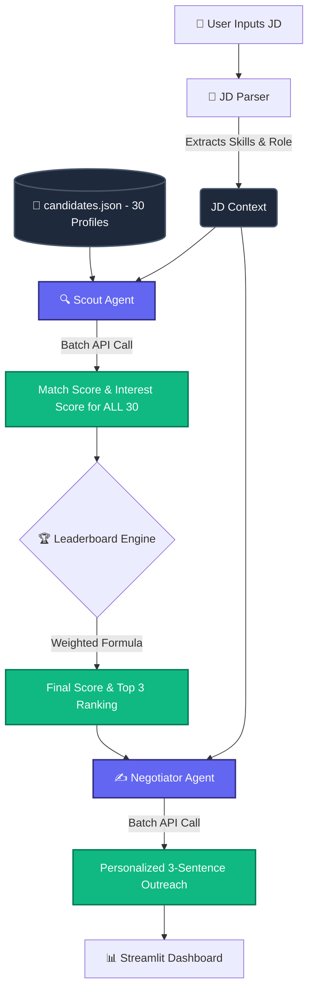

# 🎯 Nexus Scout: AI-Powered Talent Scouting Agent

**Deccan AI Catalyst Hackathon Submission**

Nexus Scout is an agentic workflow that parses Job Descriptions, evaluates candidate profiles for technical fit, and simulates recruiter outreach to gauge genuine candidate interest.

## 🔗 Links
- **Live Demo:** [Insert your Streamlit URL here]
- **Demo Video:** [Insert YouTube/Loom link here]

## 🧠 Architecture & Logic

Nexus Scout employs a Multi-Agent Architecture (Scout Agent + Negotiator Agent) utilizing Batch Processing to optimize LLM context windows and bypass rate limits.



### ⚙️ Scoring Methodology

The final ranking is determined by a weighted combination of two critical factors, all processed efficiently in a single batch to bypass strict free-tier rate limits:

1. **Match Score (60%):** 
   - Evaluates technical skills, past experience, and domain knowledge against the parsed JD requirements using Google Gemini 2.0 Flash.

2. **Interest Score (40%):** 
   - An estimate based on the candidate's hidden job satisfaction levels, salary expectations, and work mode preferences.

Once ranked, the **Negotiator Agent** drafts a highly personalized, persuasive outreach message for the Top 3 candidates to ensure maximum conversion.

*Note: The 60/40 weights are dynamically adjustable via the UI sidebar.*

## 💻 Local Setup

### 1. Install Dependencies
Clone the repo and install the required Python packages:
```bash
git clone https://github.com/YOUR_USERNAME/nexus-scout-catalyst.git
cd nexus-scout-catalyst
pip install -r requirements.txt
```

### 2. Set Up API Key
Get a **free** Gemini API key from [Google AI Studio](https://aistudio.google.com/apikey).

Create a `.env` file from the example:
```bash
cp .env.example .env
```
Edit `.env` and paste your key: `GEMINI_API_KEY="your_key"`
*(Alternatively, you can paste the key directly into the app sidebar).*

### 3. Run the App
```bash
streamlit run app.py
```

## 🛠️ Trade-offs & Tech Stack

- **Stack:** 
  - **Frontend:** Streamlit (with custom dark-mode CSS and Lottie animations)
  - **Logic:** Python 3.10+
  - **LLM Engine:** Google GenAI SDK (Gemini 2.0 Flash - Free Tier)
- **Trade-off (Batching vs Loops):** Transitioned from looping individual API calls to a single batch call for all 30 candidates. This completely bypasses the `429 RESOURCE_EXHAUSTED` error on Gemini's free tier by maximizing the context window instead of hitting RPM limits.
- **Trade-off (Data Source):** Chose a static JSON database (`data/candidates.json`) with 30 detailed synthetic profiles instead of live LinkedIn/resume scraping.

## 📂 Project Structure

```text
├── app.py                  # Main Streamlit UI and execution flow
├── data/
│   └── candidates.json     # Synthetic candidate database (30 profiles)
├── src/
│   ├── jd_parser.py        # Regex/Keyword parser for JD structuring
│   ├── llm_engine.py       # Gemini API client wrapper & JSON parser
│   ├── agents.py           # ScoutAgent and NegotiatorAgent logic
│   └── leaderboard.py      # Final score aggregation & ranking utilities
├── .streamlit/
│   └── config.toml         # Streamlit theming
├── requirements.txt        # Python dependencies
└── .env.example            # Template for environment variables
```

---
*Built with ❤️ for the Deccan Catalyst Hackathon*
