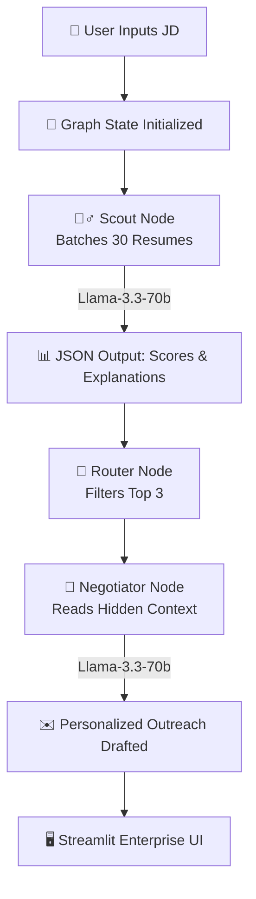

  <h1>🚀 Nexus Scout</h1>
  <h3>AI-Powered Talent Agent & Multi-Agent Negotiation Pipeline</h3>
   
  

    <a href="https://nexus-scout-catalyst.streamlit.app/" target="_blank"><strong>✨ Launch Live Demo ✨</strong></a> · 
    <a href="YOUR_YOUTUBE_OR_LOOM_LINK_HERE" target="_blank"><strong>🎥 Watch 4-Min Demo Video</strong></a>
  

---

## 🧠 Beyond a Wrapper: The Agentic Architecture

Most AI hiring tools are simple LLM wrappers that crash under heavy context limits. **Nexus Scout** is a deterministic, Multi-Agent workflow powered by **LangGraph**. It utilizes batch-chunking to bypass API rate limits and routes logic between two distinct AI personas.

🧮 The Scoring Engine
Nexus Scout doesn't just look for keyword matches; it evaluates the whole picture using a weighted hybrid algorithm:

Match Score (60% weight): The Scout Agent evaluates the candidate's technical depth, experience, and domain knowledge against the Job Description.

Interest Score (40% weight): The Negotiator Agent assesses the candidate's hidden current_job_satisfaction and salary_expectation to determine how likely they are to actually accept an offer.

Final Formula: Final Score = (Match * 0.6) + (Interest * 0.4)

🛠️ The Tech Stack
Framework: Streamlit (with custom CSS and Lottie animations)

Orchestration: LangGraph & LangChain

LLM Engine: Groq API (llama-3.3-70b-versatile)

Data Structure: Pydantic models for strict JSON enforcement.

Note on Data: To ensure deterministic, scalable testing of the agentic routing logic without violating real-world PII, this project utilizes a highly detailed synthetic database (candidates.json) of 30 diverse profiles, ranging from entry-level engineers to seasoned tech founders.

💻 Run it Locally
To fire up the LangGraph pipeline on your own machine, run the following commands:

Bash
# Clone the repository
git clone https://github.com/YOUR_USERNAME/nexus-scout-catalyst.git

# Enter the directory
cd nexus-scout-catalyst

# Install dependencies
pip install -r requirements.txt

# Create environment variables
echo 'GROQ_API_KEY="your_groq_api_key_here"' > .env

# Launch the Command Center
streamlit run app.py
