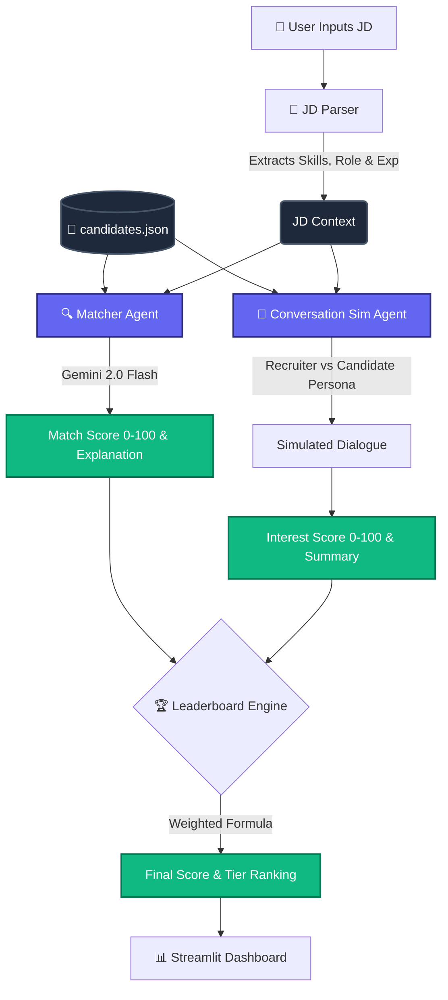

# 🎯 Nexus Scout: AI-Powered Talent Scouting Agent

**Deccan AI Catalyst Hackathon Submission**

Nexus Scout is an agentic workflow that parses Job Descriptions, evaluates candidate profiles for technical fit, and simulates recruiter outreach to gauge genuine candidate interest.

## 🔗 Links
- **Live Demo:** [Insert your Streamlit URL here]
- **Demo Video:** [Insert YouTube/Loom link here]

## 🧠 Architecture & Logic

Nexus Scout employs a multi-step agentic pipeline to identify not just the most *qualified* candidates, but those most *likely to accept* an offer.



### ⚙️ Scoring Methodology

The final ranking is determined by a weighted combination of two critical factors:

1. **Match Score (60%):** 
   - **Agent:** `src/matcher.py`
   - **Logic:** Evaluates technical skills, past experience, and domain knowledge against the parsed JD requirements using Google Gemini 2.0 Flash.
   - **Output:** A strict 0-100 score and a concise 2-sentence explainability matrix justifying the technical fit.

2. **Interest Score (40%):** 
   - **Agent:** `src/conversation_sim.py`
   - **Logic:** Runs a multi-agent simulation where an "AI Recruiter" pitches the role to a "Simulated Candidate" persona (driven by their current job satisfaction, salary expectations, and work mode preferences). 
   - **Output:** A 4-6 exchange transcript, evaluated for sentiment and alignment, yielding an Interest Score (0-100) and a summary.

*Note: The 60/40 weights are dynamically adjustable via the UI sidebar.*

## 💻 Local Setup

### 1. Install Dependencies
Clone the repo and install the required Python packages:
```bash
git clone https://github.com/YOUR_USERNAME/nexus-scout-catalyst.git
cd nexus-scout-catalyst
pip install -r requirements.txt
```

### 2. Set Up API Key
Get a **free** Gemini API key from [Google AI Studio](https://aistudio.google.com/apikey).

Create a `.env` file from the example:
```bash
cp .env.example .env
```
Edit `.env` and paste your key: `GEMINI_API_KEY="your_key"`
*(Alternatively, you can paste the key directly into the app sidebar).*

### 3. Run the App
```bash
streamlit run app.py
```

## 🛠️ Trade-offs & Tech Stack

- **Stack:** 
  - **Frontend:** Streamlit (with custom dark-mode CSS)
  - **Logic:** Python 3.10+
  - **LLM Engine:** Google GenAI SDK (Gemini 2.0 Flash - Free Tier)
- **Trade-off (Data Source):** Chose a static JSON database (`data/candidates.json`) with 10 detailed synthetic profiles instead of live LinkedIn/resume scraping. This ensures deterministic, API-limit-friendly demonstrations of the core agentic logic without risking ban/rate-limits during live hackathon judging.
- **Trade-off (Rate Limiting):** Implemented a visual 4-second delay between evaluations to gracefully handle the Gemini free-tier RPM (Requests Per Minute) limits without crashing.

## 📂 Project Structure

```text
├── app.py                  # Main Streamlit UI and execution flow
├── data/
│   └── candidates.json     # Synthetic candidate database (10 profiles)
├── src/
│   ├── jd_parser.py        # Regex/Keyword parser for JD structuring
│   ├── llm_engine.py       # Gemini API client wrapper & JSON parser
│   ├── matcher.py          # Match Scoring Agent logic
│   ├── conversation_sim.py # Multi-agent interest simulation logic
│   └── leaderboard.py      # Final score aggregation & ranking utilities
├── .streamlit/
│   └── config.toml         # Streamlit theming
├── requirements.txt        # Python dependencies
└── .env.example            # Template for environment variables
```

---
*Built with ❤️ for the Deccan Catalyst Hackathon*
