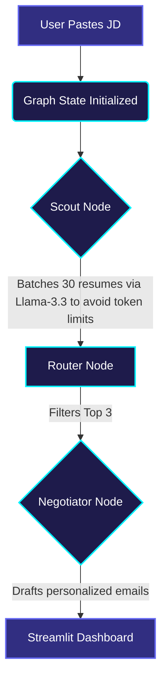

# 🎯 Nexus Scout - AI Talent Agent

Nexus Scout completely moves beyond traditional LLM wrappers by leveraging **LangGraph** to build a robust, autonomous agentic workflow for talent scouting and negotiation. It intelligently batches resumes, evaluates them against complex job descriptions, and automatically delegates the top candidates to a Negotiator Node for hyper-personalized outreach.

🚀 **Live Demo:** [Nexus Scout Catalyst](https://nexus-scout-catalyst.streamlit.app/)

---

## 🧠 Agentic Architecture

The entire backend operates on a directed graph using LangGraph, ensuring fault-tolerant, stateful processing of candidates.



---

## 📊 Scoring Logic & Math

Nexus Scout evaluates candidates using a weighted algorithm to ensure we only target top-tier talent who are actually likely to accept an offer.

*   **Match Score (0-100):** The LLM deeply evaluates the candidate's skills, past experience, and domain knowledge against the nuances of the Job Description.
*   **Interest Score (0-100):** A predictive score evaluated based on the candidate's hidden `current_job_satisfaction` and `salary_expectation`.
*   **Final Rank Formula:** The dashboard allows dynamic weight adjustments, but defaults to prioritizing skill fit while respecting retention probability:

> **Final Score = (0.6 × Match Score) + (0.4 × Interest Score)**

---

## 💡 Sample Input & Output

**Sample JD Snippet:**
> *Senior Data Scientist — Requirements: 5+ years experience, expert in Python, PyTorch, and NLP. Must have experience deploying scalable ML models.*

**Agent's Structured JSON Output:**
```json
{
  "id": "c_12",
  "match_score": 92,
  "interest_score": 85,
  "explanation": "The candidate has 6 years of experience heavily focused on PyTorch and NLP model deployment, perfectly aligning with the core requirements. Given their low job satisfaction and matching salary expectations, they are highly likely to be open to this role."
}
```

---

## 🛠️ Tech Stack & Trade-offs

*   **Frontend:** Streamlit (Custom Glassmorphic CSS, Lottie Animations, Plotly Express)
*   **Framework:** LangGraph & LangChain
*   **LLM Engine:** Groq API (`llama-3.3-70b-versatile`)
*   **Pydantic:** Guarantees 100% reliable structured JSON outputs from the LLM.

**The Data Trade-off:** Instead of live web-scraping (which is prone to rate limits and unstructured data), we built a **synthetic `candidates.json` database containing exactly 30 highly diverse profiles**. Ranging from IIT/IIM Principal Architects to entry-level interns, this ensures **deterministic, scalable testing** of the agentic routing and batching logic without breaching context windows.

---

## 💻 Local Setup

Want to run the agent locally? Follow these steps:

1. **Clone the repository**
   ```bash
   git clone https://github.com/yourusername/deccan-catalyst-scout.git
   cd deccan-catalyst-scout
   ```

2. **Install dependencies**
   ```bash
   pip install -r requirements.txt
   ```

3. **Configure Environment Variables**
   Create a `.env` file in the root directory and add your Groq API key:
   ```env
   GROQ_API_KEY="your_api_key_here"
   ```

4. **Launch the Agent**
   ```bash
   streamlit run app.py
   ```
