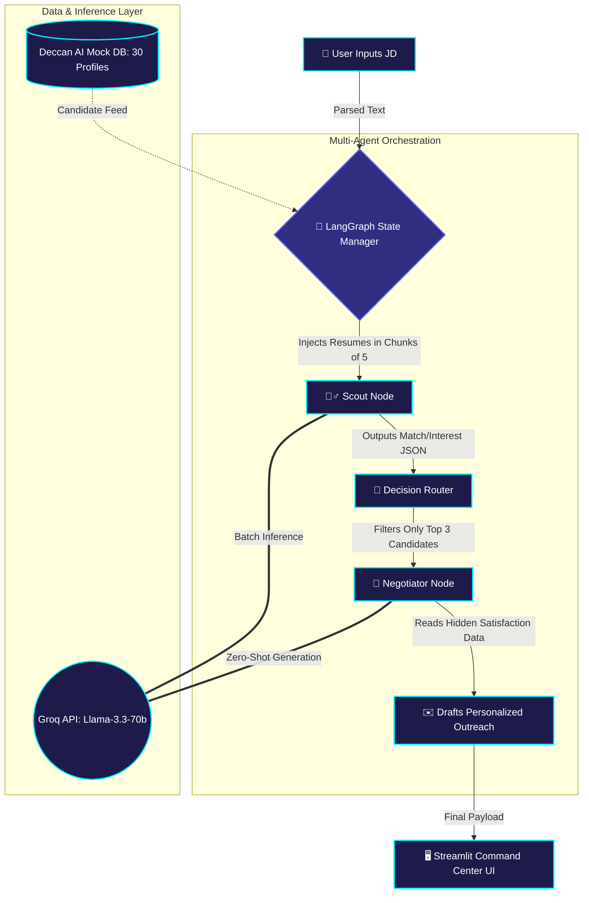

<div align="center">
  <h1>🚀 Nexus Scout</h1>
  <h3>AI-Powered Talent Agent & Multi-Agent Negotiation Pipeline</h3>
  <br />

  **[✨ Launch Live Demo ✨](https://nexus-scout-catalyst.streamlit.app/)** · **[🎥 Watch 4-Min Demo Video](YOUR_YOUTUBE_OR_LOOM_LINK_HERE)**

</div>

---

## 🧠 Beyond a Wrapper: The Agentic Architecture

Most AI hiring tools are simple LLM wrappers that crash under heavy context limits. **Nexus Scout** is a deterministic, Multi-Agent workflow powered by **LangGraph**. It utilizes batch-chunking to bypass API rate limits and routes logic between two distinct AI personas.



---

## 🧮 The Scoring Engine

Nexus Scout doesn't just look for keyword matches; it evaluates the whole picture using a weighted hybrid algorithm:

*   **Match Score (60% weight):** The *Scout Agent* evaluates the candidate's technical depth, experience, and domain knowledge against the Job Description.
*   **Interest Score (40% weight):** The *Negotiator Agent* assesses the candidate's hidden `current_job_satisfaction` and `salary_expectation` to determine how likely they are to actually accept an offer.

> **Final Formula:**  
> `Final Score = (Match Score × 0.6) + (Interest Score × 0.4)`

---

## 🛠️ The Tech Stack & AI Declaration

*   **Framework:** Streamlit (with Plotly custom charts & Lottie animations)
*   **Orchestration:** LangGraph & LangChain
*   **LLM Engine:** Groq API (`llama-3.3-70b-versatile`)
*   **Data Structure:** Pydantic models for strict JSON enforcement

🤖 **AI Tools Declaration:** In accordance with hackathon guidelines, this project was architected and developed utilizing the AntiGravity IDE, powered by Google Gemini 3.1 Pro and Claude Code, to rapidly prototype the LangGraph architecture, manage boilerplate, and optimize the multi-agent routing logic within the 48-hour window.

💡 **Note on Data:** To ensure deterministic, scalable testing of the agentic routing logic without violating real-world PII, this project utilizes a highly detailed synthetic database (`candidates.json`) of 30 diverse profiles, including customized easter-egg profiles of the Deccan AI leadership and engineering teams.

---

## 💻 Run it Locally

To fire up the LangGraph pipeline on your own machine, run the following commands:

```bash
# Clone the repository
git clone https://github.com/TechieSamosa/nexus-scout-catalyst.git

# Enter the directory
cd nexus-scout-catalyst

# Install dependencies
pip install -r requirements.txt

# Create environment variables
echo 'GROQ_API_KEY="your_groq_api_key_here"' > .env

# Launch the Command Center
streamlit run app.py
```
